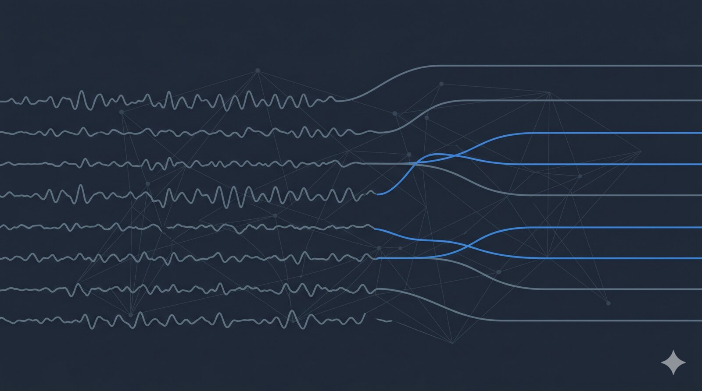

{fig-alt=""}

Launch issue. Quiet week on the industry side — the signal this week comes from preprints. Meta's brain team (Banville, d'Ascoli, Rapin, King and collaborators) released both a benchmarking framework and a new event-detection model in three days, and a separate group put the EEG decoding stack on notice about preprocessing fragility.

## AI & Decoding

**Meta brain team posts DANCE, an end-to-end detector for raw EEG events.** Lévy, Banville, Rapin, King, Moreau, and d'Ascoli describe a deep-learning pipeline that jointly detects *and* classifies neural events directly from raw, unaligned EEG — no pre-windowed trials, no known onsets. They claim state-of-the-art across ten datasets, including seizure monitoring, and match onset-informed BCI accuracy without using onset information. The trick is treating event detection as a first-class problem rather than a preprocessing step, which is the right inversion for streaming clinical EEG. (Preprint, not peer reviewed.) [arXiv:2605.10688](https://arxiv.org/abs/2605.10688)

**Same team releases NeuralBench, and the headline result is awkward for the foundation-model crowd.** A 14-author release led by Banville (with King again on the author list) puts current neural foundation models on a unified benchmark across neuroimaging tasks — and reports that "current foundation models only marginally outperform task-specific models." If that holds up under review it's the most useful sanity check in NeuroAI this year: scaling pretrained encoders for neural data is harder than the press releases suggest, and the gap to bespoke models is smaller than the field has been claiming. Worth following the discussion. (Preprint.) [arXiv:2605.08495](https://arxiv.org/abs/2605.08495)

## Tools & Data

**EEG decoders flip 42% of predictions when only the preprocessing changes.** Hou and colleagues run six EEG datasets across four BCI paradigms through varied preprocessing pipelines while holding the model and split fixed, and find up to 42% of trial-level predictions flip. This is a reproducibility story masquerading as a methods paper — it puts a number on something the field has known anecdotally for years, and it has direct implications for anyone shipping an EEG decoder to a regulated clinical setting where pipeline drift between training and deployment is a real risk. If you maintain a neuro-ML codebase, this is the paper to circulate. (Preprint.) [arXiv:2605.07212](https://arxiv.org/abs/2605.07212)
