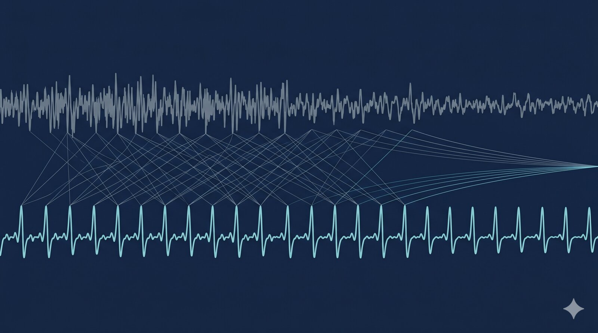

{fig-alt=""}

The KU Leuven group that asked at ICLR 2026 whether EEG foundation models are worth it has shown the case where they are — cross-modality, scalp-to-intracranial, calibrated in tens of minutes. Meta's brain team continues its release torrent. ARIA closes its £50M non-surgical neurotech full-proposal window.

## AI & Decoding

**CORTEG turns scalp-EEG pretraining into a working ECoG decoder.** Yang, Sun, Van Dyck, Calvo Merino and Van Hulle — the same Leuven group whose "Are EEG Foundation Models Worth It?" paper went up at ICLR 2026 three weeks ago — take a pretrained scalp-EEG foundation model, drop in an electrode-aware spatial adapter, and use a dual-stream tokenizer that splits low-frequency and high-gamma activity before leave-one-subject-out fine-tuning. They report 10–30 minutes of calibration on a single GPU, with the resulting decoder matching or exceeding task-specific baselines on a public finger-flexion benchmark and producing statistically significant gains on audio decoding. The framing is what's interesting: the ICLR paper found that foundation models often don't beat compact networks in low-data settings; CORTEG identifies a specific case — cross-modality, cross-patient — where they do, and puts a calibration cost on it. (Preprint.) [arXiv:2605.10337](https://arxiv.org/abs/2605.10337)

**Meta brain team posts TRIBE v2.** D'Ascoli, Rapin, Benchetrit, Banville, King and collaborators release a multimodal foundation model for forecasting fMRI responses to vision, audition and language stimuli, trained on a unified 1,000-hour corpus across 720 subjects. The pitch is in-silico neuroscience — predicting brain responses to novel stimuli, tasks and subjects. Worth watching how it benchmarks against bespoke subject-specific predictors when those head-to-head numbers land. (Preprint.) [arXiv:2605.04326](https://arxiv.org/abs/2605.04326)

## Tools & Data

**NeuralSet ships from the same Meta brain team.** King and 27 collaborators put out a PyTorch-native framework unifying preprocessing across fMRI, M/EEG and spikes, with lazy loaders for naturalistic datasets and pretrained deep-learning embeddings as a first-class layer. Inside ten days of last week's NeuralBench release the lab has paired a benchmark with a toolkit, which is the right order of operations. The space is already busy — MNE-Python, Braindecode, NeuroKit2 — and adoption will turn on whether the abstractions are worth the migration. (Preprint.) [arXiv:2605.03169](https://arxiv.org/abs/2605.03169)

## UK 🇬🇧

**ARIA closes the TA1 full-proposal window on Massively Scalable Neurotechnologies.** Deadline fell on 8 May. The £50M brief is unusually direct: deliver responsive neural interfaces *without* surgery, organised around three pillars — biological readout (TA1.1), wireless deep-brain actuators (TA1.2), and closed-loop integration (TA1.3). ARIA is explicitly courting groups that don't think of themselves as neurotechnologists, including synthetic biology, immunotherapy and developmental biology. Award decisions are the next thing to watch — this is the largest single-source non-surgical-neurotech bet in the UK and the awardee list will shape the ecosystem for years. [ARIA — Massively Scalable Neurotechnologies, Funding](https://aria.org.uk/opportunity-spaces/scalable-neural-interfaces/massively-scalable-neurotechnologies/funding/)
