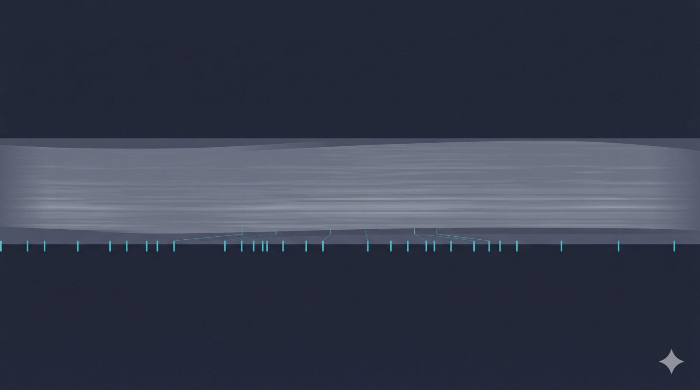

{fig-alt=""}

Quiet weekend on the industry side; the week's signal is sitting on arXiv. MIT's Katabi lab pushes EEG foundation models from short-window decoding up to session scale with a clinical-text alignment target, and a UC Santa Cruz group lands a paired benchmark-and-application release that makes a serious case for Mamba spike forecasting in closed-loop BCIs.

## AI & Decoding

**CLEF lifts clinical EEG foundation models from windows to whole sessions.** Cao, Mirzazadeh, Lee, Videnovic and Katabi (MIT) tokenise EEG sessions as 3D multitaper spectrograms — tractable enough to run a Transformer over an entire recording — and align the embeddings against neurologist reports and structured EHR data through contrastive objectives. On a new 234-task benchmark spanning 260k+ EEG sessions from 108k+ patients, CLEF beats prior EEG foundation models on 229 of 234 tasks and lifts mean AUROC from 0.65 to 0.74. The structural move is the alignment target: most EEG FMs stop at self-supervised reconstruction; CLEF pulls the representation toward a clinical semantic space described by free-text reports. Reconstruction-only pretraining already beats the prior generation; report and EHR alignment is what stretches the gap, with held-out concept and external-cohort experiments suggesting the representations transfer past the alignment labels. (Preprint, not peer reviewed.) [arXiv:2605.10817](https://arxiv.org/abs/2605.10817)

**Behaviour decoding falls out of next-step spike forecasts.** Minnick and colleagues (UC Santa Cruz — Haussler, Teodorescu, Eshraghian) train a single Mamba forecaster on next-step Neuropixels spike counts, then read mouse behaviour off the model's *predicted* rates with a lightweight per-session linear head. On Steinmetz's visual-discrimination benchmark (39 sessions, ~27k neurons), they hit 75.7% trial-vote on choice and 66.1% on stimulus side, beating a matched 500 ms-context linear decoder on raw spike counts by 4–6 pp. The framing is operational: one forward pass covers forecast and readout, a 100–150-trial session-start block lands within 1–2 pp of asymptote, and the pipeline fits inside a 50 ms bin budget on workstation GPUs — specced for tethered chronic Neuropixels in a closed loop, not just papers. (Preprint.) [arXiv:2605.12999](https://arxiv.org/abs/2605.12999)

## Tools & Data

**SpikeProphecy puts a sharper ruler on population forecasting.** From the same UCSC group, the companion benchmark: 105 Neuropixels sessions, ~89,800 neurons (Steinmetz 2019 + IBL Repeated Site), seven baselines across four families — three diagonal SSMs, one non-diagonal SSM, a Transformer, an LSTM, and a spiking network. The contribution is methodological: a single aggregate Pearson r collapses temporal fidelity, spatial pattern accuracy and magnitude-invariant alignment into one number that masks what the model is actually doing. The three-way decomposition surfaces a brain-region predictability ranking that holds across all seven baselines and survives an ANCOVA correction for firing-statistics covariates, and exposes a sub-Poisson evaluation floor where rigorous metrics meet biophysical regularity in spike trains. Useful in the same way NeuralBench was ten days ago — it constrains how the field reports results, not just which models it runs. (Preprint.) [arXiv:2605.12992](https://arxiv.org/abs/2605.12992)
