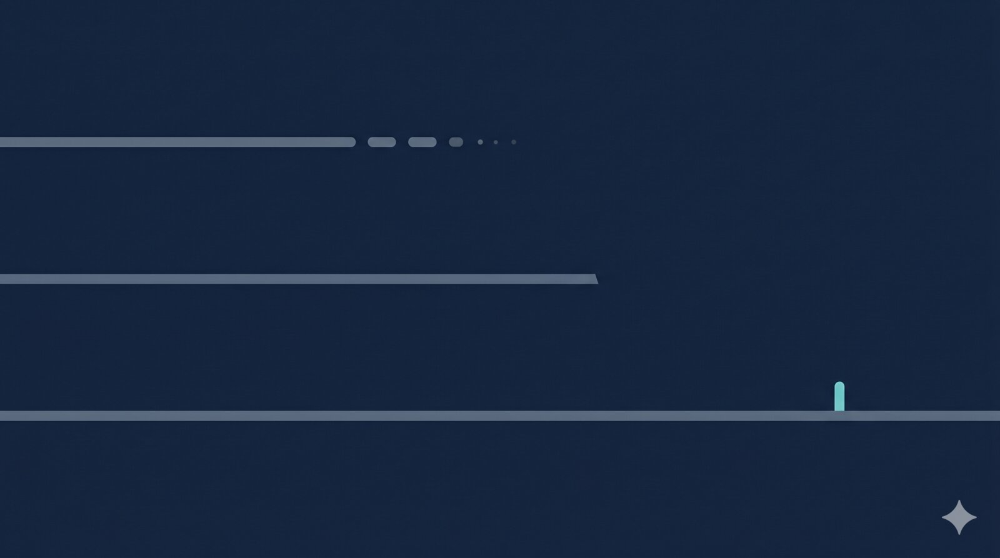

{fig-alt=""}

Quiet week. The AI thread this fortnight has stayed on the same beat — independent benchmarks finding EEG foundation models barely beat task-specific baselines — and a fourth instalment from a KU Leuven / MIT axis now lands in the same place. Off arXiv, the news is industry: a Neuralink handwriting demo without supporting data, and the orderly shutdown of a flagship UK bioelectronics JV.

## AI & Decoding

**NeuroAtlas: a fourth benchmark, the same verdict.** Kontras, Liang and 14 co-authors (KU Leuven plus Paul Pu Liang's group at MIT) cast a wider net than the existing EEG benchmarks — pulling together datasets spanning epilepsy, sleep medicine, ICU monitoring and brain–computer interfaces, then evaluating not just accuracy but clinical-utility surrogates: event-level decision quality, hypnogram-derived features, brain-age gap. The verdict reads like [NeuralBench from 13 May](../2026-05-13/index.qmd): pretrained models "perform largely on par, with only narrow advantages for a few, and current models do not yet deliver on the promise of an out-of-the-box unified EEG model." Four independent benchmarks now sit in the same camp — NeuralBench, [SpikeProphecy](../2026-05-17/index.qmd), Brain4FMs and NeuroAtlas. The methodological contribution is the clinical-utility metric set: standard ML scores undersell *and* oversell foundation models depending on the task, and NeuroAtlas ships the metrics needed to disambiguate. (Preprint, not peer reviewed.) [arXiv:2605.14698](https://arxiv.org/abs/2605.14698)

## Industry

**Neuralink demos handwriting from N1, without the data.** Posted to X on 20 May: a PRIME Study participant produced a digital signature that, per the patient quote, "looked like [their] own." No technical write-up, no decoder spec, no character-error rate, no recording duration. PRIME has previously demonstrated cursor control and ~40 wpm typing; continuous-trajectory handwriting is a different problem and a worthwhile one to log. As currently sourced it's a press beat with one image, and worth no more than a line until the underlying evaluation lands. [Neuralink updates](https://neuralink.com/updates/)

## UK 🇬🇧

**Galvani Bioelectronics prepares for orderly shutdown.** GSK and Verily's bioelectronic-medicines joint venture — established 2016 with up to £540m committed across seven years from the two parents — is winding down. The close is described as orderly rather than insolvent, but the substance is that one of the higher-profile bets on stimulating peripheral nerves to substitute for pharmacological intervention in inflammatory and metabolic disease has not produced a product in nine years and the parents have run out of runway. Galvani sat in the ARIA-adjacent corner of UK neurotech and is on `SOURCES.md` — that line should now read past-tense. No GSK statement on the public press-release feed at the time of writing; primary coverage sits in trade press. [Neurotech Reports — April 2026 issue](https://www.neurotechreports.com/issues/CurrentBBRIndex.html) · [Companies House record](https://find-and-update.company-information.service.gov.uk/company/09984862)
