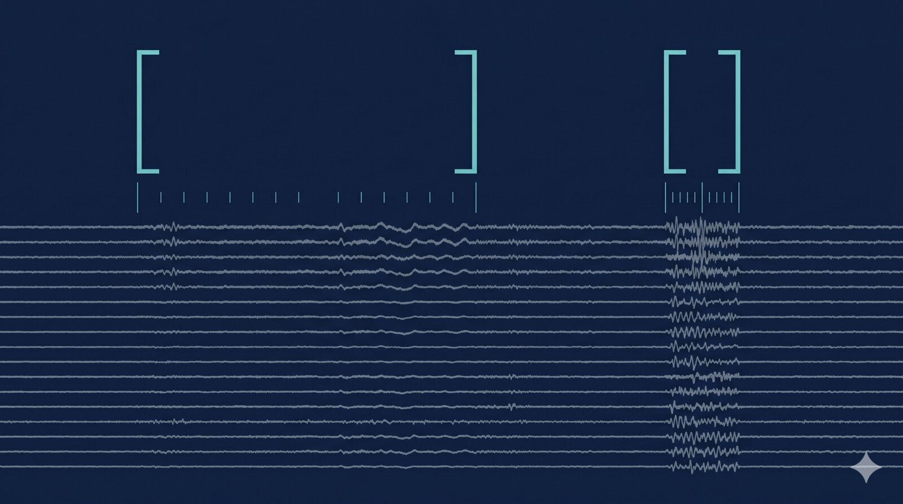

{fig-alt=""}

The launch week of this newsletter, and a useful one to land on: an almost-pure preprint week, with industry near-silent and the centre of gravity sitting on arXiv. Two threads worth pulling on. First, the evaluation infrastructure for neural foundation models is finally catching up to the models themselves — three independent groups landed work this week that puts harder rulers against existing claims. Second, the architectures that are working are pushing in the same direction: long context, with carefully chosen alignment targets.

## Theme 1: The benchmarks are growing teeth

The single most-discussed result of the week was Meta's NeuralBench preprint, which puts current neural foundation models on a unified benchmark across neuroimaging tasks and reports that they "only marginally outperform task-specific models." If that holds up under review, it is the most useful sanity check NeuroAI has had in a year — the bespoke-vs-pretrained gap is smaller than the cumulative press-release tally has implied, and the field's "scale and you're done" narrative needs trimming.

NeuralBench did not arrive alone. Hou and colleagues showed that EEG decoders flip up to 42% of trial-level predictions when only the preprocessing pipeline changes, holding model and data split fixed across six datasets and four BCI paradigms. SpikeProphecy from the UCSC group (Haussler, Teodorescu, Eshraghian) makes a parallel argument one stack down: a single aggregate Pearson r between predicted and actual spike counts collapses temporal fidelity, spatial pattern accuracy and magnitude alignment into one number that masks what the model is actually doing, and their decomposition surfaces a brain-region predictability ranking that holds across seven baselines. And CORTEG (KU Leuven) — explicitly framed as a follow-up to the same group's "Are EEG Foundation Models Worth It?" — picks the specific case where foundation pretraining *does* beat compact task-specific networks: cross-modality, cross-patient, with a 10–30 minute calibration budget.

This is the AI/ML craft thread, and it is the most important shift in the field's posture this week. Methods papers that constrain how the community *reports* results — not just which architectures it runs — compound. They make next year's claims falsifiable in a way last year's were not. If I had to pick one thing to circulate at work, it would be one of these three, depending on the audience: Hou et al for anyone shipping an EEG decoder into a regulated setting, NeuralBench for anyone planning a pretraining run, SpikeProphecy for anyone evaluating spike-population models.

## Theme 2: Long context, alignment-target choice

The other half of the week's arXiv haul shows the architectures that *are* working. CLEF (MIT, Katabi lab) takes EEG foundation modelling from the usual short-window regime up to session scale by tokenising whole recordings as 3D multitaper spectrograms and aligning the embeddings against neurologist reports and structured EHR data through contrastive learning. The result — 229 out of 234 benchmark tasks improved over prior EEG FMs, mean AUROC 0.65 → 0.74 — is interesting, but the structural lesson is the alignment-target choice: pulling the representation toward a clinical semantic space, rather than stopping at self-supervised reconstruction, is what stretches the gap.

The UCSC Mamba spike forecaster is the same lesson in a different modality. A single long-context next-step forecaster, trained only to predict upcoming Neuropixels activity, turns out to carry behavioural information in its predicted rates that a linear readout extracts better than the same readout on raw spikes. Meta's TRIBE v2 fits the same template — multimodal forecasting of fMRI responses to vision, audition and language at the 1,000-hour, 720-subject scale. The pattern across the three: longer context windows, denser alignment targets, and a willingness to let the downstream readout be small.

## Frontier Watch

**Mamba next-step spike forecasters as decoders** ([arXiv:2605.12999](https://arxiv.org/abs/2605.12999)). The UCSC release is the most provocative architectural finding of the week. A single Mamba forecaster trained only on next-step Neuropixels spike counts hits 75.7% trial-vote on choice and 66.1% on stimulus side on the Steinmetz visual-discrimination benchmark, beating a matched 500 ms-context linear decoder on raw spike counts by 4–6 percentage points — and it gets there with no behavioural supervision at training time. The closed-loop pitch is hard to wave away: one forward pass covers forecast and readout, calibration is ~100–150 trials, the pipeline fits inside a 50 ms bin budget on workstation GPUs. The paired benchmark, [SpikeProphecy](https://arxiv.org/abs/2605.12992), is the right way to publish this — it ships with the ruler it asks you to evaluate it against. Worth reading both as one release.

## What I'm watching next week

- **ARIA TA1 awardee decisions.** The £50M Massively Scalable Neurotechnologies full-proposal window closed 8 May; the awardee list will set the shape of the UK non-surgical-neurotech ecosystem for years. No date published yet.
- **NeuralBench community response.** If Meta's "FMs only marginally beat task-specific models" claim survives initial pushback, it changes how the next round of pretraining grants get justified.
- **Whether the industry signal returns.** Two weeks of near-silence from Neuralink, Synchron, Paradromics, Precision and Blackrock is unusual; expect at least one cadence-resetting press release.
- **Meta brain team release pace.** Four preprints in two weeks (DANCE, NeuralBench, NeuralSet, TRIBE v2). Does the cadence hold, and at what point does it start to crowd the rest of the field's airtime?
- **Naveen Rao's Neurotech Notables #54** (May 1–15). Useful for industry items the primary-source sweep missed.
